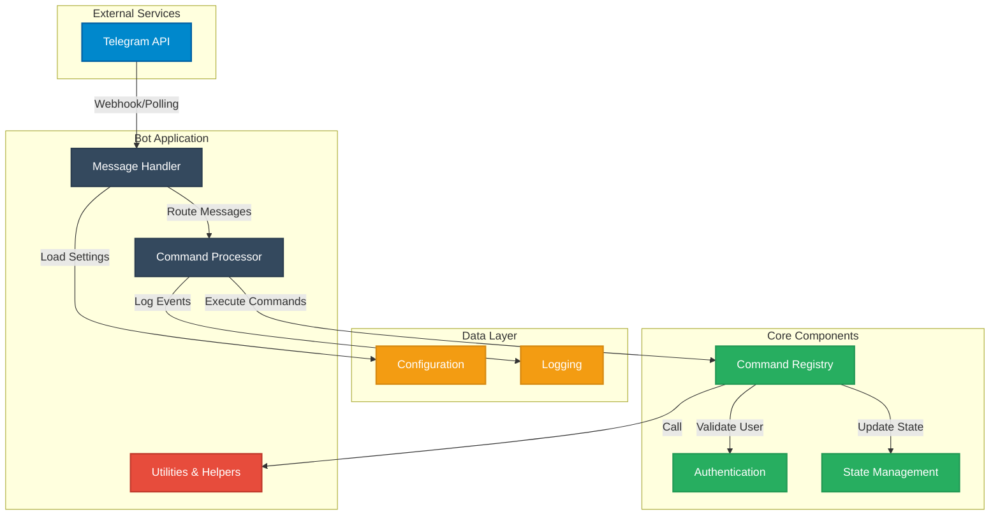

# TelegramBot Architecture Overview

This document provides an architectural overview of the TelegramBot system.

## System Architecture Diagram

## Component Descriptions

### External Services
- **Telegram API**: The Telegram Bot API that the application communicates with via HTTP requests

### Bot Application Layer
- **Message Handler**: Receives and routes incoming messages from Telegram
- **Command Processor**: Processes user commands and triggers appropriate handlers
- **Utilities & Helpers**: Common utility functions used throughout the application

### Data Layer
- **Configuration**: Manages bot settings and configuration parameters
- **Logging**: Handles application logging and event tracking

### Core Components
- **Authentication**: Validates users and manages permissions
- **Command Registry**: Maintains registered commands and their handlers
- **State Management**: Manages bot and user state information

## Data Flow

1. User sends a message to the Telegram bot
2. Telegram API forwards the message to the bot
3. Message Handler receives and parses the incoming message
4. Command Processor determines the command type
5. Command Registry executes the appropriate command handler
6. Auth component validates user permissions
7. State Management updates relevant state
8. Logger records the event
9. Response is sent back through Telegram API
